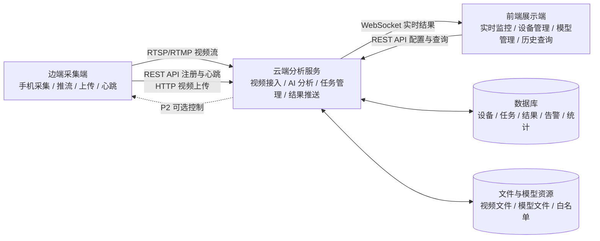
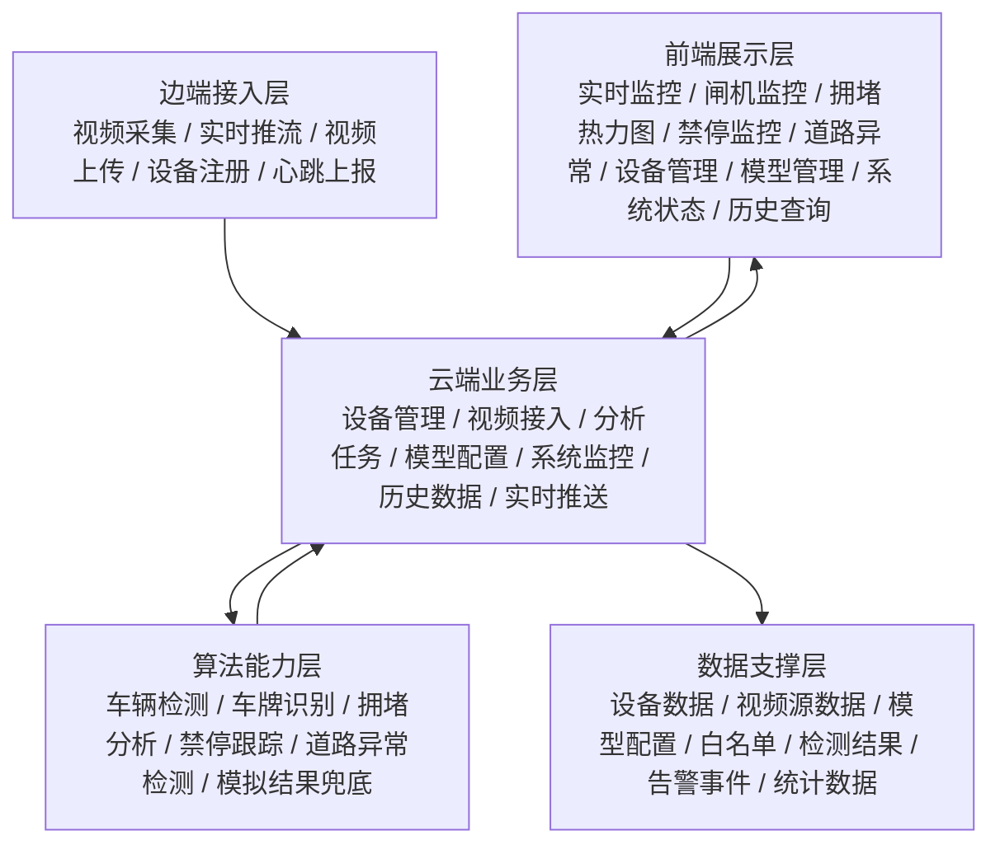
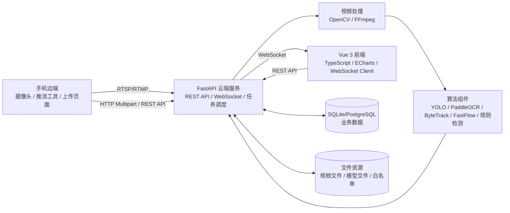
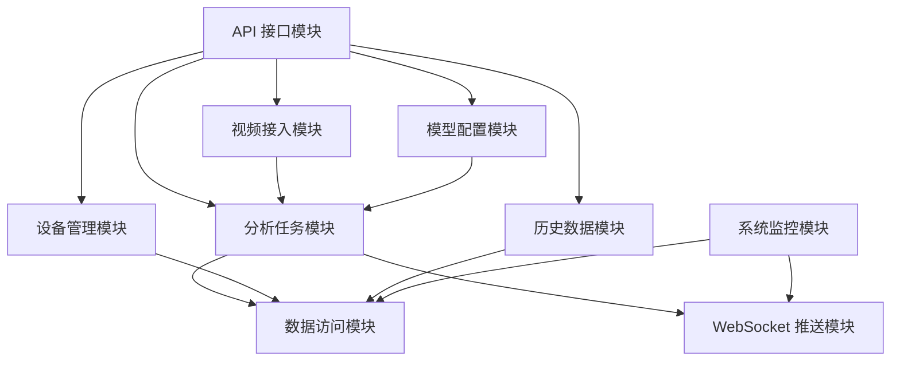
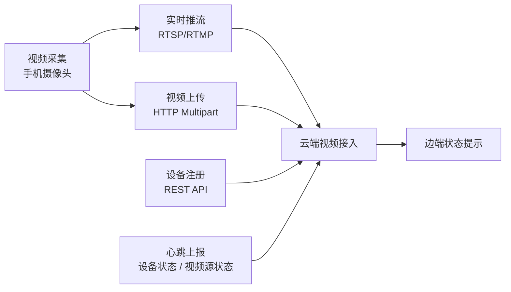
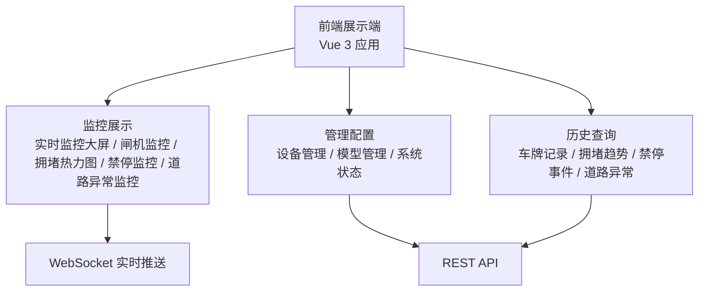
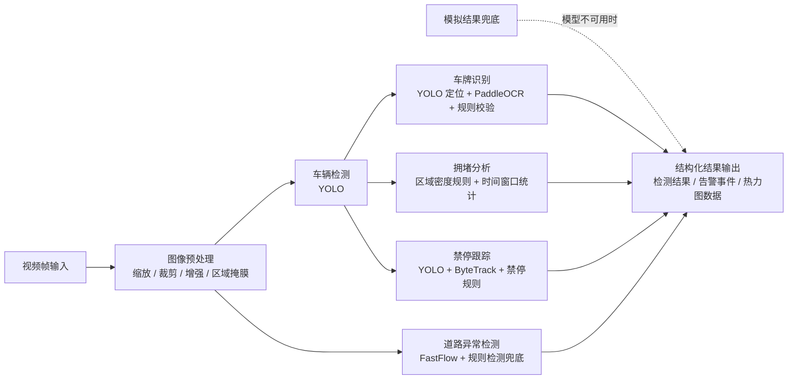
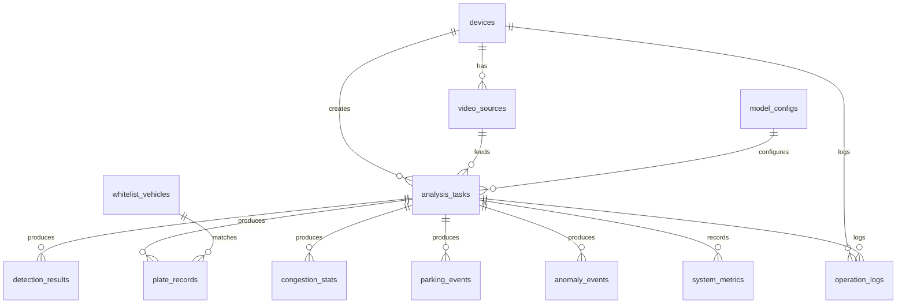

# 系统设计图绘制说明

## 1. 文档目的

本文档用于指导《系统设计方案 V1.0》中 8 张系统设计图的绘制，保证图形风格统一、内容准确、层级清晰、便于课程评审阅读。

本文档不直接替代系统设计方案正文，而是作为绘图实施说明。绘图时应以《需求分析报告 V1.0》和《系统设计方案 V1.0》为依据，避免引入正文未确认的模块、技术或流程。

## 2. 绘图总体建议

### 2.1 推荐绘图方式

建议优先使用可控绘图工具完成正式图片，例如 draw.io、ProcessOn、Visio、Figma 或 Mermaid。若使用 AI 生成图片，应先用本文档中的结构和提示词生成草图，再人工检查和调整文字、连线、层级和模块名称。

不建议直接让 AI 自由生成最终图片。自由生成容易出现文字错误、模块缺失、连线混乱、技术栈误写和中文不清晰等问题。

### 2.2 推荐工作流

建议采用以下工作流绘制 8 张图：

1. 先根据本文档确认每张图的“图形目的”和“必须出现的内容”。
2. 使用 draw.io、ProcessOn 或 Mermaid 生成第一版结构图。
3. 对照《系统设计方案 V1.0》检查模块名称、技术名称和数据流方向。
4. 统一颜色、字体、边框、箭头和图例。
5. 导出 PNG 或 SVG，插入系统设计方案对应章节。
6. 最后检查图片在 Word、Markdown 或 PDF 中是否清晰可读。

### 2.3 AI 辅助绘图建议

AI 更适合做以下工作：

| 可让 AI 辅助的内容 | 不建议完全交给 AI 的内容 |
|---|---|
| 生成图形结构草案 | 直接生成最终可提交图片 |
| 帮助整理模块层级 | 自动决定系统架构边界 |
| 生成 Mermaid 代码 | 自动生成中文文字密集图片 |
| 优化布局建议 | 自动替换技术路线 |
| 检查图形是否遗漏模块 | 无人工校对直接提交 |

若使用 AI 图片生成工具，建议提示词中明确要求“中文文字清晰、模块少而精、不要添加未给出的技术、不要生成复杂背景、不要使用装饰性图标过多”。

## 3. 统一视觉规范

### 3.1 统一图形风格

8 张图应保持同一视觉风格，建议采用“科技蓝 + 中性灰 + 少量告警橙”的简洁风格。

| 元素 | 建议样式 |
|---|---|
| 背景 | 白色或极浅灰色 |
| 主色 | 蓝色，用于云端、核心服务和主链路 |
| 辅色 | 绿色，用于边端和正常数据流 |
| 强调色 | 橙色或红色，用于告警、异常和风险 |
| 数据层 | 浅紫色或浅灰色 |
| 模型/算法层 | 浅青色或浅蓝色 |
| 字体 | 黑体、微软雅黑、思源黑体或等价无衬线字体 |
| 边框 | 1-1.5 pt，圆角矩形或直角矩形统一使用一种 |
| 箭头 | 单向箭头表示数据流，双向箭头表示请求响应或配置交互 |

### 3.2 统一颜色建议

建议所有图使用以下颜色语义：

| 类别 | 颜色语义 |
|---|---|
| 边端设备 | 绿色系 |
| 云端服务 | 蓝色系 |
| 前端展示 | 紫色系 |
| 数据存储 | 灰色或深蓝灰 |
| 模型/算法 | 青色系 |
| 告警/异常 | 橙色或红色 |
| 扩展能力 | 虚线边框或浅灰 |

### 3.3 统一命名规范

图中模块名称应尽量与系统设计方案一致，不要频繁切换术语。

建议统一使用以下名称：

| 推荐名称 | 避免混用 |
|---|---|
| 边端采集端 | 手机端、移动端、采集端混用 |
| 云端分析服务 | 后端服务、服务器、云端平台混用 |
| 前端展示端 | Web 端、展示端、大屏端混用 |
| 视觉感知算法模块 | AI 模块、模型模块、算法层混用 |
| 模拟结果兜底 | 模拟推理、假数据、Mock 混用 |
| 道路异常检测 | 异常物体检测、目标检测混用 |

### 3.4 统一连线规范

| 连线类型 | 表示含义 |
|---|---|
| 实线单向箭头 | 主要数据流，如视频流、分析结果 |
| 实线双向箭头 | 请求响应交互，如 REST API |
| 虚线箭头 | 可选能力、兜底能力或 P2 扩展链路 |
| 粗箭头 | 核心演示链路 |
| 橙色箭头 | 告警或异常事件流 |

### 3.5 控制复杂度原则

每张图中一级模块建议控制在 5-9 个。若模块太多，应通过分层、分组或折叠方式表达，不要在一张图中堆满所有字段和接口。

图中只写模块名称和关键数据，不写长句。详细说明应放在正文中，不放进图里。

## 4. 8 张图的绘制方案

## 4.1 图 4-1 系统总体架构图

### 图形目的

展示系统整体由边端采集端、云端分析服务、前端展示端、数据存储和模型资源组成，并说明三端之间的核心通信链路。本图用于展示边端手机、云端分析服务、前端展示端、数据库、模型资源和视频文件之间的总体关系。图中应突出视频流、REST API、WebSocket 和数据存储之间的关系。

### 推荐画法

建议采用“左中右三端架构 + 下方数据与模型资源”的布局。

左侧放置边端采集端，中间放置云端分析服务，右侧放置前端展示端，下方放置数据库、视频文件和模型资源。

### 必须包含内容

| 区域 | 内容 |
|---|---|
| 左侧 | 手机边端、视频采集、实时推流、视频上传、设备注册、心跳上报 |
| 中间 | 云端分析服务、视频接入、AI 分析、任务管理、实时推送 |
| 右侧 | 前端展示端、实时监控、设备管理、模型管理、历史查询 |
| 下方 | SQLite/PostgreSQL、视频文件、模型资源、白名单车辆库 |
| 连线 | RTSP/RTMP、HTTP 上传、REST API、WebSocket |

### 不要画的内容

不要在总体架构图中展开所有后端内部模块，也不要展开数据库表字段。总体架构图只负责说明系统边界和协作关系。

### Mermaid 草图



### 优质提示词

```text
请绘制一张中文系统总体架构图，主题为“云边端协同的智慧交通视觉感知系统”。采用左中右布局：左侧为边端采集端，包含手机采集、实时推流、视频上传、设备注册、心跳上报；中间为云端分析服务，包含视频接入、AI 分析、任务管理、结果推送；右侧为前端展示端，包含实时监控、设备管理、模型管理、历史查询；下方为数据库、视频文件、模型资源和白名单车辆库。用箭头标注 RTSP/RTMP 视频流、HTTP 视频上传、REST API、WebSocket。云端到边端的控制链路用虚线表示 P2 可选能力。整体风格简洁、科技蓝、中文清晰、不要添加额外模块。
```

## 4.2 图 5-1 系统功能架构图

### 图形目的

展示系统功能如何分层组织，说明功能覆盖需求分析中的边端采集、云端分析、监控展示、平台管理和历史查询。本图用于展示系统功能的层级关系，建议按照“前端展示层、云端业务层、算法能力层、边端接入层、数据支撑层”组织，突出各功能模块之间的支撑关系

### 推荐画法

建议采用“自上而下分层架构图”。顶部为前端展示层，中间为云端业务层和算法能力层，底部为边端接入层和数据支撑层。

### 必须包含内容

| 层级 | 模块 |
|---|---|
| 前端展示层 | 实时监控大屏、闸机监控、拥堵热力图、禁停监控、道路异常监控、设备管理、模型管理、系统状态、历史查询 |
| 云端业务层 | 设备管理、视频接入、分析任务、模型配置、系统监控、历史数据、实时推送 |
| 算法能力层 | 车辆检测、车牌识别、拥堵分析、禁停跟踪、道路异常检测、模拟结果兜底 |
| 边端接入层 | 视频采集、实时推流、视频上传、设备注册、心跳上报 |
| 数据支撑层 | 设备数据、视频源数据、模型配置、白名单、检测结果、告警事件、统计数据 |

### 不要画的内容

不要写具体技术如 FastAPI、Vue、SQLite、YOLO。功能架构图只表达系统能做什么，不表达用什么技术实现。

### Mermaid 草图



### 优质提示词

```text
请绘制一张中文系统功能架构图，主题为“智慧交通视觉感知系统功能架构”。采用自上而下分层布局，分为前端展示层、云端业务层、算法能力层、边端接入层、数据支撑层。前端展示层包含实时监控大屏、闸机监控、拥堵热力图、禁停监控、道路异常监控、设备管理、模型管理、系统状态、历史查询。云端业务层包含设备管理、视频接入、分析任务、模型配置、系统监控、历史数据、实时推送。算法能力层包含车辆检测、车牌识别、拥堵分析、禁停跟踪、道路异常检测、模拟结果兜底。边端接入层包含视频采集、实时推流、视频上传、设备注册、心跳上报。数据支撑层包含设备数据、视频源数据、模型配置、白名单、检测结果、告警事件、统计数据。不要写具体技术栈，风格简洁统一，层次清晰。
```

## 4.3 图 6-1 系统技术架构图

### 图形目的

展示系统采用哪些技术组件实现边端采集、云端分析、前端展示、数据存储和模型推理。本图用于展示系统主要技术组件及通信方式，建议包含手机边端、视频传输协议、云端 FastAPI 服务、视频处理模块、AI 推理模块、数据库、文件存储、WebSocket 推送和 Vue 前端。

### 推荐画法

建议采用“技术组件分层 + 通信协议标注”的布局。左侧边端，中间后端和算法，右侧前端，下方数据和文件资源。

### 必须包含内容

| 技术区域 | 内容 |
|---|---|
| 边端 | 手机摄像头、推流工具或上传页面 |
| 通信 | RTSP/RTMP、HTTP Multipart、REST API、WebSocket |
| 后端 | Python、FastAPI、Uvicorn、Pydantic、SQLAlchemy |
| 视频处理 | OpenCV、FFmpeg |
| 算法 | YOLO、PaddleOCR、ByteTrack、FastFlow、规则检测、模拟结果兜底 |
| 前端 | Vue 3、TypeScript、Vite、ECharts、WebSocket Client |
| 数据 | SQLite/PostgreSQL、视频文件、模型文件、白名单数据 |

### 不要画的内容

不要展开所有业务功能页面，也不要把技术架构图画成功能架构图。技术架构图重点是技术组件和协议。

### Mermaid 草图



### 优质提示词

```text
请绘制一张中文系统技术架构图，主题为“云边端协同智慧交通视觉感知系统技术架构”。采用左中右布局：左侧为手机边端，包含摄像头、推流工具、上传页面；中间为云端服务，包含 Python、FastAPI、Uvicorn、REST API、WebSocket、任务调度、OpenCV、FFmpeg；中间下方或右侧为算法组件，包含 YOLO、PaddleOCR、ByteTrack、FastFlow、规则检测、模拟结果兜底；右侧为 Vue 3 前端，包含 TypeScript、Vite、ECharts、WebSocket Client；底部为 SQLite/PostgreSQL、视频文件、模型文件、白名单数据。用箭头标注 RTSP/RTMP、HTTP Multipart、REST API、WebSocket。不要加入未确认技术，文字清晰，风格专业。
```

## 4.4 图 8-1 后端服务功能模块图

### 图形目的

展示后端服务内部模块划分和模块之间的调用关系。本图用于展示后端服务内部的 API 接口、设备管理、视频接入、分析任务、模型配置、系统监控、历史数据、WebSocket 推送和数据访问等模块关系。

### 推荐画法

建议采用“中心任务模块 + 周边业务模块”的布局。分析任务模块位于中心，周围连接 API 接口、设备管理、视频接入、模型配置、系统监控、历史数据、WebSocket 推送和数据访问。

### 必须包含内容

API 接口模块、设备管理模块、视频接入模块、分析任务模块、模型配置模块、系统监控模块、历史数据模块、WebSocket 推送模块、数据访问模块。

### Mermaid 草图



### 优质提示词

```text
请绘制一张中文后端服务功能模块图，主题为“云端后端服务模块设计”。将分析任务模块放在中心，周围包含 API 接口模块、设备管理模块、视频接入模块、模型配置模块、系统监控模块、历史数据模块、WebSocket 推送模块、数据访问模块。用箭头表示模块调用关系：API 调用设备、视频、任务、模型、历史模块；视频接入和模型配置支撑分析任务；分析任务输出结果给 WebSocket 推送和数据访问模块；系统监控向前端推送状态并可写入数据访问模块。风格简洁，中文清晰，不要加入数据库字段。
```

## 4.5 图 9-1 边端采集功能模块图

### 图形目的

展示手机边端需要承担的视频采集、视频传输和设备状态上报功能。本图用于展示边端采集模块中的视频采集、实时推流、视频上传、设备注册、心跳上报和状态提示等功能关系。

### 推荐画法

建议采用“输入采集 -> 传输方式 -> 状态上报 -> 云端接入”的横向流程型模块图。

### 必须包含内容

视频采集、实时推流、视频上传、设备注册、心跳上报、状态提示、云端接入。

### Mermaid 草图



### 优质提示词

```text
请绘制一张中文边端采集功能模块图，主题为“手机边端采集模块”。采用横向结构，展示手机摄像头视频采集后分为两条输入路径：实时推流 RTSP/RTMP 和视频上传 HTTP Multipart，两条路径都进入云端视频接入。另画设备注册 REST API、心跳上报、视频源状态上报和边端状态提示。突出边端只负责采集、传输和状态上报，不承担重型 AI 推理。风格清晰简洁，使用绿色表示边端。
```

## 4.6 图 10-1 前端展示功能模块图

### 图形目的

展示前端页面和功能视图，说明前端如何服务监控、管理和历史查询。本图用于展示前端展示模块中的实时监控大屏、闸机监控、拥堵热力图、禁停区域监控、道路异常监控、设备管理、模型管理、系统状态和历史查询等页面关系。

### 推荐画法

建议采用“前端应用中心 + 页面模块分组”的布局。中心为前端展示端，周围按监控展示、管理配置、历史查询三个分组展开。

### 必须包含内容

实时监控大屏、闸机监控视图、拥堵热力图视图、禁停区域监控视图、道路异常监控视图、设备管理页面、模型管理页面、系统状态页面、历史查询与统计页面。

### Mermaid 草图



### 优质提示词

```text
请绘制一张中文前端展示功能模块图，主题为“前端监控与管理模块”。中心为前端展示端 Vue 3 应用，分为三个功能分组：监控展示、管理配置、历史查询。监控展示包含实时监控大屏、闸机监控、拥堵热力图、禁停区域监控、道路异常监控；管理配置包含设备管理、模型管理、系统状态；历史查询包含车牌记录、拥堵趋势、违规停车事件、道路异常事件。标注 WebSocket 用于实时推送，REST API 用于管理配置和历史查询。不要加入后端内部模块，页面关系清晰。
```

## 4.7 图 11-1 视觉感知算法功能模块图

### 图形目的

展示视觉感知算法模块内部能力和输入输出关系，突出真实模型与模拟结果兜底的关系。本图用于展示算法模块中的视频帧输入、预处理、车辆检测、车牌识别、拥堵分析、禁停跟踪、道路异常检测、模拟结果兜底和结构化结果输出之间的关系。

### 推荐画法

建议采用“视频帧输入 -> 预处理 -> 五类算法能力 -> 统一结构化输出”的横向流程模块图。

### 必须包含内容

视频帧输入、预处理、车辆检测、车牌识别、拥堵分析、禁停跟踪、道路异常检测、模拟结果兜底、结构化结果输出。

### Mermaid 草图



### 优质提示词

```text
请绘制一张中文视觉感知算法功能模块图，主题为“交通视觉感知算法模块”。采用横向流程：视频帧输入进入图像预处理，预处理后进入车辆检测 YOLO、车牌识别 YOLO 定位 + PaddleOCR + 规则校验、拥堵分析 区域密度规则 + 时间窗口统计、禁停跟踪 YOLO + ByteTrack + 禁停规则、道路异常检测 FastFlow + 规则检测兜底。右侧统一输出结构化结果，包括检测结果、告警事件、热力图数据。模拟结果兜底用虚线连接到结构化输出，表示模型不可用时使用。不要把道路异常检测画成目标检测主方案，中文清晰。
```

## 4.8 图 12-1 数据库 ER 图

### 图形目的

展示系统核心数据表和表之间的关系，支撑设备管理、任务管理、模型配置、检测结果、告警事件和历史查询。本图用于展示设备、视频源、分析任务、模型配置、检测结果、车牌记录、白名单车辆、拥堵统计、停车事件、异常事件、系统指标和操作日志等实体之间的关系。


### 推荐画法

建议采用 ER 图。将 `analysis_tasks` 放在中心，左侧放 `devices` 和 `video_sources`，上方放 `model_configs`，右侧放检测结果、车牌记录、拥堵统计、停车事件、异常事件，下方放系统指标和日志。

### 必须包含数据表

devices、video_sources、analysis_tasks、model_configs、whitelist_vehicles、detection_results、plate_records、congestion_stats、parking_events、anomaly_events、system_metrics、operation_logs。

### 建议关系

| 关系 | 说明 |
|---|---|
| devices 1:N video_sources | 一个设备可对应多个视频源 |
| devices 1:N analysis_tasks | 一个设备可产生多个分析任务 |
| video_sources 1:N analysis_tasks | 一个视频源可产生多个分析任务 |
| model_configs 1:N analysis_tasks | 一个模型配置可被多个任务使用 |
| analysis_tasks 1:N detection_results | 一个任务产生多个检测结果 |
| analysis_tasks 1:N plate_records | 一个任务产生多条车牌记录 |
| whitelist_vehicles 1:N plate_records | 一个白名单车辆可对应多次识别命中 |
| analysis_tasks 1:N congestion_stats | 一个任务产生多条拥堵统计 |
| analysis_tasks 1:N parking_events | 一个任务产生多个禁停事件 |
| analysis_tasks 1:N anomaly_events | 一个任务产生多个异常事件 |
| analysis_tasks 1:N system_metrics | 一个任务可关联多条系统指标 |
| operation_logs 可关联设备、任务或配置 | 日志用于记录关键操作 |

### Mermaid 草图



### 优质提示词

```text
请绘制一张中文数据库 ER 图，主题为“智慧交通视觉感知系统数据库 ER 图”。包含 12 张表：devices、video_sources、analysis_tasks、model_configs、whitelist_vehicles、detection_results、plate_records、congestion_stats、parking_events、anomaly_events、system_metrics、operation_logs。将 analysis_tasks 放在中心，devices 和 video_sources 放左侧，model_configs 放上方，检测结果、车牌记录、拥堵统计、停车事件、异常事件放右侧，system_metrics 和 operation_logs 放下方。标注一对多关系：设备到视频源、设备到分析任务、视频源到分析任务、模型配置到分析任务、分析任务到各类结果和事件、白名单车辆到车牌记录。图中只展示表名和关键字段，不要把所有字段都塞满，保证清晰可读。
```

## 5. 保证一致性和易读性的建议

### 5.1 先用 Mermaid 或 draw.io 生成结构图

建议先用 Mermaid 或 draw.io 绘制结构图，再进行美化。这样能保证模块和连线正确，避免 AI 图片生成时出现文字错误。

### 5.2 建立统一图例

8 张图应使用统一图例，例如绿色表示边端，蓝色表示云端，紫色表示前端，灰色表示数据存储，青色表示算法，橙色表示告警。

### 5.3 控制每张图的信息密度

总体架构图不超过 6 个主块，功能架构图不超过 5 层，技术架构图不超过 7 类技术组件，模块图每张不超过 10 个模块，ER 图只展示关键字段。

### 5.4 使用相同术语

图中的模块名称必须与系统设计方案保持一致。例如使用“模拟结果兜底”而不是“模拟推理”，使用“FastFlow 异常检测”而不是“目标检测异常物体”。

### 5.5 先审图再美化

每张图应先检查以下问题，再进行美化：

1. 是否与系统设计方案章节一致。
2. 是否遗漏核心模块。
3. 是否出现未确认技术。
4. 箭头方向是否正确。
5. 文字是否清晰可读。
6. 是否与其他图重复过多。

### 5.6 最终交付格式

建议每张图导出两种格式：PNG 用于插入 Word 或 PDF，SVG 用于保留高清可编辑版本。

如果使用 Mermaid，建议同时保存 Mermaid 源码，便于后续修改。
